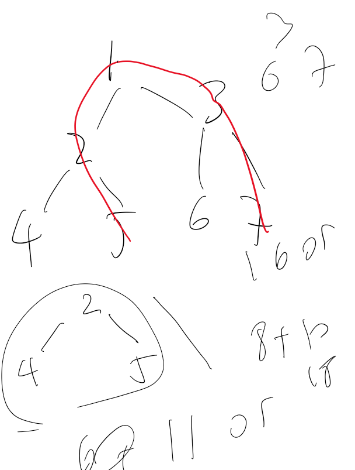

Max Path Sum

For this problem, we have to identify the pattern of mps.

Each node will have a triangle, a single left or right branch or a continuing left or right branch. 

We can use priorityque (in java) or a list sort in python and javascript to find the max value.

This naive solution will have a complexity of 

O(n+nlog(n)) time | O(n) space

An improved method would be to create a list to return without a big list to add all the values.

This best solution will have a complexity of 

O(n) time | O(log(n)) space