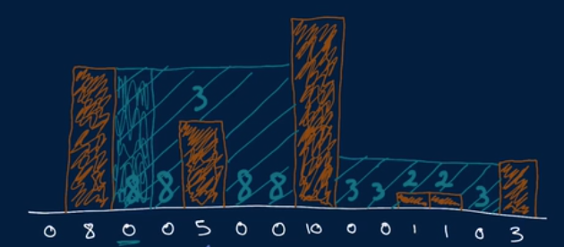

Water Area

For this problem it is important to understand what the problem is exactly asking. 
It is easier to understand the problem once you draw a picture.

In the first method, we can make an array for recording the biggest height and add the remainder of the subtraction of the max height with the current height to the total water variable.

This would give us O(n) time | O(n) space

In the second method, we can do away with the array and simply use a variable to assign the max height. 

This would give us O(n) time | O(1) space